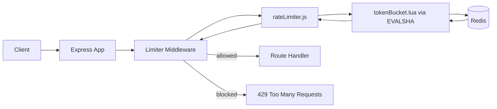

# Redis + Lua Token Bucket Rate Limiter (Node.js)

[](https://github.com/SoorajSundar1505/distributed-token-bucket-rate-limiter)


Production-style, Redis-backed **token bucket rate limiter** using **Node.js + Express + ioredis + Lua**.

Built to show backend fundamentals interviewers care about:

- Atomic state updates with Redis Lua
- Correct burst + refill behavior (`10/min`, capacity `10`)
- Distributed-safe design (shared Redis state)
- Clean middleware integration with `429` responses
- **`EVALSHA` script caching**, **Redis `TIME`** for consistent clocks, **cluster-safe key tags**, and **configurable fail-open / fail-closed** behavior

---

## TL;DR

- **Problem:** prevent API abuse without breaking legitimate bursts
- **Approach:** token bucket in Redis, computed atomically via Lua
- **Result:** smooth request shaping, race-free under concurrency
- **Default policy:** capacity `10`, refill `10` tokens per minute (`RATE_LIMIT_REFILL_PER_MINUTE`)

---

## Why This Project Stands Out

Most sample limiters are in-memory and break in distributed systems.  
This implementation is designed for real-world backend architecture:

- Works across multiple app instances (shared Redis state)
- Uses Redis Lua for race-free token calculations
- Uses **`EVALSHA`** after `SCRIPT LOAD` to avoid shipping the script body every request (reloads automatically on `NOSCRIPT` after Redis restarts)
- Uses **Redis `TIME`** inside Lua so all app nodes share the same clock for limiter math
- **Fail-open** by default on Redis errors (configurable to **fail-closed** with `503`)
- Clear separation of concerns (config, limiter core, middleware, routes)

If you are evaluating backend engineering quality, this repo shows practical understanding of **concurrency, performance, and API reliability**.

---

## Tech Stack

- **Runtime:** Node.js
- **Framework:** Express
- **Datastore:** Redis
- **Redis Client:** ioredis
- **Core Logic:** Lua script executed atomically with **`EVALSHA`** (falls back to loading the script if the SHA is missing)

---

## Rate Limiting Model

### Token Bucket

- **Capacity:** `10` tokens (default; see environment variables)
- **Refill rate:** `10` tokens per minute by default (`~0.166` tokens per second)
- Every request consumes 1 token
- Request is allowed if the bucket has at least 1 token
- Otherwise the API responds with **HTTP 429** and a **`Retry-After`** header

This allows short bursts (up to 10 immediate requests) while enforcing sustained throughput over time.

---

## Why Not Fixed Window?

Fixed window can allow a burst around the window boundary.  
Example: 10 requests at `59s` + 10 requests at `60s` can effectively allow 20 almost instantly.

Token bucket avoids this by refilling gradually over time instead of resetting all at once.

---

## Redis Key Design

Keys are derived from a **prefix that includes a Redis Cluster hash tag** so `:tokens` and `:last` always land in the same slot:

```txt
rate:{<client_id>}:tokens
rate:{<client_id>}:last
```

The middleware currently sets `<client_id>` to `req.ip`. Behind a reverse proxy, set **`TRUST_PROXY=true`** so `req.ip` reflects the client.

---

## Configuration (environment variables)

| Variable | Default | Description |
| --- | --- | --- |
| `PORT` | `3000` | HTTP listen port |
| `REDIS_URL` | — | Full Redis URL (e.g. `redis://:pass@host:6379/0` or `rediss://` for TLS) |
| `REDIS_HOST` | `localhost` | Ignored if `REDIS_URL` is set |
| `REDIS_PORT` | `6379` | Ignored if `REDIS_URL` is set |
| `REDIS_PASSWORD` | — | Ignored if `REDIS_URL` is set |
| `REDIS_USERNAME` | — | ACL username (Redis 6+); ignored if `REDIS_URL` is set |
| `REDIS_DB` | — | Numeric DB index; ignored if `REDIS_URL` is set |
| `REDIS_CONNECT_TIMEOUT_MS` | `10000` | Connection timeout |
| `REDIS_COMMAND_TIMEOUT_MS` | `5000` | Per-command timeout |
| `REDIS_MAX_RETRIES` | `3` | ioredis `maxRetriesPerRequest` |
| `RATE_LIMIT_CAPACITY` | `10` | Bucket capacity (tokens) |
| `RATE_LIMIT_REFILL_PER_MINUTE` | `10` | Sustained refill rate in tokens per minute |
| `RATE_LIMIT_KEY_TTL_MS` | `60000` | `PX` TTL on bucket keys (idle cleanup; long idle ⇒ fresh bucket after expiry) |
| `RATE_LIMIT_FAIL_OPEN` | `true` | If `false` or `0`, Redis errors yield **503** instead of passing the request |
| `TRUST_PROXY` | — | Set to `true` or `1` to enable `trust proxy` (needed for correct `req.ip` behind many load balancers) |

---

## Project Structure

```txt
src/
  app.js
  config/
    redis.js
  limiter/
    rateLimiter.js
    tokenBucket.lua
  middleware/
    limiterMiddleware.js
  routes/
    testRoutes.js
```

---

## Architecture



---

## How It Works (Request Flow)

1. Request enters Express middleware.
2. Middleware builds a Redis key prefix with a hash tag, e.g. `rate:{<ip>}`.
3. `rateLimiter.js` runs **`SCRIPT LOAD` once**, then **`EVALSHA`** for each check (reloads on `NOSCRIPT`).
4. Lua script:
   - reads **`TIME`** from Redis and computes `now` in milliseconds
   - loads token count + last refill timestamp
   - applies refill using elapsed time; **if time goes backward**, elapsed is clamped to `0`
   - clamps tokens to capacity
   - decrements one token if available
   - stores updated values with a configurable **`PX` TTL**
5. Middleware returns:
   - `200` for allowed requests (with rate limit headers)
   - `429 Too Many Requests` when the bucket is empty (with **`Retry-After`**)

Because Lua execution is atomic inside Redis, concurrent requests are handled safely.

---

## Quick Start

### 1) Clone and install

```bash
git clone <your-repo-url>
cd rate-limiter
npm install
```

### 2) Install and start Redis (no Docker)

Make sure Redis is running locally on `localhost:6379`, or point the app at your instance with `REDIS_URL`.

macOS (Homebrew):

```bash
brew install redis
brew services start redis
```

Linux (Debian/Ubuntu):

```bash
sudo apt update
sudo apt install redis-server
sudo systemctl enable redis-server
sudo systemctl start redis-server
```

Quick check:

```bash
redis-cli ping
```

Expected output: `PONG`

### 3) Run the server

```bash
npm start
```

Server starts on `http://localhost:3000` by default.

---

## Test the Limiter

Send rapid requests:

```bash
for i in {1..12}; do
  curl -s -o /dev/null -w "%{http_code}\n" http://localhost:3000/
done
```

Optional: include rate limit headers:

```bash
for i in {1..12}; do
  curl -i -s http://localhost:3000/ | rg "HTTP/|X-RateLimit|Retry-After|RateLimit"
  echo "----"
done
```

Expected behavior:

- Early requests: `200`
- After bucket depletion: `429`
- `X-RateLimit-Limit`, `X-RateLimit-Remaining`, and (on `429`) `Retry-After` / `RateLimit` are set

---

## API Behavior

### Response headers

- `X-RateLimit-Limit` — bucket capacity
- `X-RateLimit-Remaining` — whole tokens left after this request (if allowed) or current balance when denied
- `RateLimit` — compact hint, e.g. `limit=10, remaining=5` or with `reset=<unix>` when blocked
- `Retry-After` — seconds until at least one token is expected (only on **429**)

### Allowed request

- Status: `200`
- Body: `{ "message": "API working" }`
- Headers include `X-RateLimit-*` and `RateLimit`

### Rate-limited request

- Status: `429`
- Body: `{ "message": "Too many requests" }`
- Headers include `Retry-After` and `RateLimit` with `reset`

### Redis unavailable (fail-closed)

When `RATE_LIMIT_FAIL_OPEN=false`:

- Status: `503`
- Body: `{ "message": "Rate limiter unavailable" }`

Structured error logs use the field `msg: "rate_limiter_redis_error"` and a **SHA-256 prefix** of the Redis key (not the raw client id).

---

## Design Decisions

- **Redis + Lua instead of app memory:** supports horizontal scaling.
- **Atomic token math in Lua:** avoids race conditions under concurrency.
- **Redis `TIME` in Lua:** one clock for all nodes; avoids skew across app servers.
- **Negative elapsed clamp:** if `now < last`, refill does not steal tokens.
- **`EVALSHA`:** less network overhead than sending the full script per request.
- **Hash tag in key prefix:** Redis Cluster keeps `tokens` / `last` in the same slot.
- **Fail-open by default:** preserves availability when Redis is down; override when abuse protection must win.
- **TTL on keys:** keeps Redis clean for inactive clients; after TTL, the next request starts with a full bucket.

---

## Roadmap / extensions

- Identity-based keys (API key / user id) instead of or in addition to IP
- Automated integration tests (burst + refill timing)
- Metrics (allowed / denied / latency histograms) and dashboards

---

## Key Design Considerations

- Token bucket provides smoother rate limiting than fixed window by avoiding burst spikes at boundaries.
- Redis enables shared state across instances for distributed rate limiting.
- Lua scripting ensures atomic execution under concurrent requests.
- Fail-open vs fail-closed trades availability for strict enforcement.
- Tune `RATE_LIMIT_KEY_TTL_MS` if idle “full bucket after silence” is not what you want for your product.

---

## License

MIT (or your preferred license)
