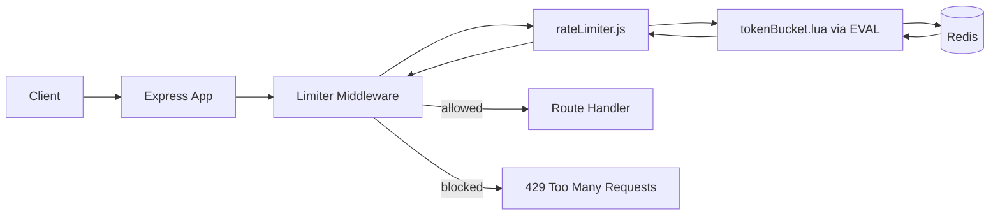

# Redis + Lua Token Bucket Rate Limiter (Node.js)

[](https://github.com/SoorajSundar1505/distributed-token-bucket-rate-limiter)


Production-style, Redis-backed **token bucket rate limiter** using **Node.js + Express + ioredis + Lua**.

Built to show backend fundamentals interviewers care about:
- Atomic state updates with Redis Lua
- Correct burst + refill behavior (`10/min`, capacity `10`)
- Distributed-safe design (shared Redis state)
- Clean middleware integration with `429` responses

---

## TL;DR

- **Problem:** prevent API abuse without breaking legitimate bursts
- **Approach:** token bucket in Redis, computed atomically via Lua
- **Result:** smooth request shaping, race-free under concurrency
- **Current policy:** capacity `10`, refill rate `10/60` tokens/sec (`~0.166/sec`)

---

## Why This Project Stands Out

Most sample limiters are in-memory and break in distributed systems.  
This implementation is designed for real-world backend architecture:

- Works across multiple app instances (shared Redis state)
- Uses Redis Lua for race-free token calculations
- Fail-open middleware strategy to protect availability
- Clear separation of concerns (config, limiter core, middleware, routes)

If you are evaluating backend engineering quality, this repo shows practical understanding of **concurrency, performance, and API reliability**.

---

## Tech Stack

- **Runtime:** Node.js
- **Framework:** Express
- **Datastore:** Redis
- **Redis Client:** ioredis
- **Core Logic:** Lua script executed atomically with `EVAL`

---

## Rate Limiting Model

### Token Bucket

- **Capacity:** `10` tokens
- **Refill rate:** `10/60` tokens per second (`~0.166/sec`, i.e., 10 per minute)
- Every request consumes 1 token
- Request is allowed if bucket has at least 1 token
- Otherwise API responds with **HTTP 429**

This allows short bursts (up to 10 immediate requests) while enforcing sustained throughput over time.

---

## Why Not Fixed Window?

Fixed window can allow a burst around the window boundary.
Example: 10 requests at `59s` + 10 requests at `60s` can effectively allow 20 almost instantly.

Token bucket avoids this by refilling gradually over time instead of resetting all at once.

---

## Redis Key Design

```txt
rate:<client_id>:tokens
rate:<client_id>:last
```

This keeps token state and refill timestamp separate, making updates explicit and easier to reason about.

---

## Project Structure

```txt
src/
  app.js
  config/
    redis.js
  limiter/
    rateLimiter.js
    tokenBucket.lua
  middleware/
    limiterMiddleware.js
  routes/
    testRoutes.js
```

---

## Architecture



---

## How It Works (Request Flow)

1. Request enters Express middleware.
2. Middleware builds a Redis key (currently by IP).
3. `rateLimiter.js` executes `tokenBucket.lua` via `redis.eval(...)`.
4. Lua script:
   - loads token count + last refill timestamp
   - calculates elapsed refill
   - clamps tokens to capacity
   - decrements token if available
   - stores updated values with TTL
5. Middleware returns:
   - `200` for allowed request
   - `429 Too Many Requests` when bucket is empty

Because Lua execution is atomic inside Redis, concurrent requests are handled safely.

---

## Quick Start

### 1) Clone and install

```bash
git clone <your-repo-url>
cd rate-limiter
npm install
```

### 2) Install and start Redis (no Docker)

Make sure Redis is running locally on `localhost:6379`.

macOS (Homebrew):

```bash
brew install redis
brew services start redis
```

Linux (Debian/Ubuntu):

```bash
sudo apt update
sudo apt install redis-server
sudo systemctl enable redis-server
sudo systemctl start redis-server
```

Quick check:

```bash
redis-cli ping
```

Expected output: `PONG`

### 3) Run the server

```bash
npm start
```

Server starts on `http://localhost:3000`.

---

## Test the Limiter

Send rapid requests:

```bash
for i in {1..12}; do
  curl -s -o /dev/null -w "%{http_code}\n" http://localhost:3000/
done
```

Optional: include remaining tokens in output:

```bash
for i in {1..12}; do
  curl -i -s http://localhost:3000/ | rg "HTTP/|X-RateLimit-Remaining"
  echo "----"
done
```

Expected behavior:
- Early requests: `200`
- After bucket depletion: `429`
- `X-RateLimit-Remaining` header decreases as tokens are consumed

---

## API Behavior

### Response Headers

- `X-RateLimit-Remaining`

### Allowed request

- Status: `200`
- Body: `{ "message": "API working" }`
- Header: `X-RateLimit-Remaining: <n>`

### Rate-limited request

- Status: `429`
- Body: `{ "message": "Too many requests" }`

---

## Design Decisions

- **Redis + Lua instead of app memory:** supports horizontal scaling.
- **Atomic token math in Lua:** avoids race conditions under concurrency.
- **Fail-open on Redis failure:** preserves API availability (can be changed to fail-closed based on business requirements).
- **TTL on keys:** keeps Redis clean for inactive clients.

---

## Improvements I Would Ship Next

- Add `Retry-After` and `X-RateLimit-Limit` headers
- Use trusted identity key (API key / user ID) instead of only IP
- Add automated integration tests (burst + refill timing)
- Parameterize limits via environment variables
- Add observability (metrics, logs, dashboards)
- Add Redis script caching with `EVALSHA`

---

## Key Design Considerations

- Token Bucket provides smoother rate limiting compared to fixed window by avoiding burst spikes at boundaries  
- Redis enables shared state across multiple instances for distributed rate limiting  
- Lua scripting ensures atomic execution, preventing race conditions under concurrent requests  
- Fail-open vs fail-closed strategies impact availability vs strict enforcement  
- System can be extended for production using Redis Cluster, API key-based limits, and observability  

---


## License

MIT (or your preferred license)